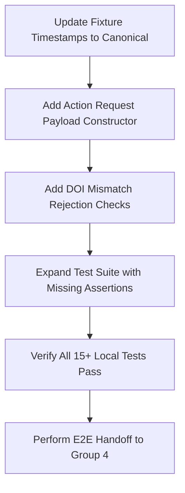

# Day-8 Scientific Canon & Live Context Closure Readiness Audit

## 1. Executive Summary

This report presents a comprehensive read-only readiness audit of the VANA Group 2 SANSKAR integration layer for the Day-8 Scientific Canon and Live Context Closure task. 

While the Day-7 baseline successfully established a functional validation adapter ([`sanskar_adapter.py`](file:///c:/Pratik_Bhuwad/VANA/GROUP2_THANE_CREEK/05_INTEGRATION/adapter/sanskar_adapter.py)) and passed 13/13 local unit tests, this audit shows that **several critical implementation gaps and external dependencies must be resolved before Day-8 E2E closure is achieved**:
1. **Divergent Test Fixtures:** The local synthetic observation fixture uses a timestamp (`2026-08-14T12:00:00Z`) that diverges from the canonical Group 1 observation timestamp (`2026-08-13T09:14:22Z`).
2. **Missing Group 4 Handoff:** The codebase does not currently construct the Group 4 Action Request payload.
3. **Conflicting DOIs:** Multiple documents across team members contain conflicting DOI references for the ScienceDirect study and JAXA extent metadata.
4. **SANSKAR Container Blockers:** The FastAPI web service is down, and host-to-container port configurations mismatch.

Therefore, the final verdict for this stream is **MULTIPLE_GAPS**, and Pratik must execute targeted code changes to bridge the remaining implementation gaps while tracking external blockers.

---

## 2. Current Pratik Status

*   **Adapter Logic:** Complete but lacking Action Request construction.
*   **Local Unit Tests:** 13/13 passing locally on mock fixtures.
*   **Documentation:** Contracts are documented but require updates for Group 4 contracts.
*   **Overall Readiness:** **PARTIAL** (Ready to code the remaining Day-8 deliverables).

---

## 3. Canonical Observation Verification

The canonical Group 1 observation properties (sourced from Sakshi's coordination status) are:
*   **Observation ID:** `TC-Z03-F02-LIDAR-OBS001`
*   **Status:** `SYNTHETIC_TEST`
*   **Coordinates:** `19.1288, 72.9421` (Kanjurmarg Zone 3)
*   **Timestamp:** `2026-08-13T09:14:22Z`
*   **Parameter:** `canopy_height`
*   **Value:** `4.7`
*   **Unit:** `m`
*   **Method:** `LiDAR canopy scan`

---

## 4. Canonical vs. Synthetic Fixture Diff

Evaluating the canonical observation properties against our synthetic test fixture ([`TC-Z03-F02-LIDAR-OBS001.synthetic.json`](file:///c:/Pratik_Bhuwad/VANA/GROUP2_THANE_CREEK/05_INTEGRATION/fixtures/TC-Z03-F02-LIDAR-OBS001.synthetic.json)) reveals key divergences:

| Attribute | Canonical Group 1 Observation | Group 2 Synthetic Fixture | Difference / Diff |
| :--- | :--- | :--- | :--- |
| **Observation ID** | `TC-Z03-F02-LIDAR-OBS001` | `TC-Z03-F02-LIDAR-OBS001` | Identical (Preserved) |
| **Latitude** | `19.1288` | `19.1288` | Identical (Preserved) |
| **Longitude** | `72.9421` | `72.9421` | Identical (Preserved) |
| **Timestamp** | `2026-08-13T09:14:22Z` | `2026-08-14T12:00:00Z` | **DIVERGENT** (26 hr 45 min shift) |
| **Measurement Structure**| Flat properties | Wrapped under `"measurement"` | Structural wrapper difference |
| **Parameter** | `canopy_height` | `canopy_height` | Identical (Preserved) |
| **Value** | `4.7` | `4.7` | Identical (Preserved) |
| **Unit** | `m` | `m` | Identical (Preserved) |
| **Method** | `LiDAR canopy scan` | `LiDAR canopy scan` | Identical (Preserved) |

---

## 5. Scientific Evidence / DOI Conflict Matrix

An audit of the DOI references across the project repository reveals conflicting mappings:

| Source | DOI / Reference | Claimed Role | Files Mapped | Validity |
| :--- | :--- | :--- | :--- | :--- |
| **ScienceDirect / Elsevier (2023)** | `10.1016/j.rsma.2023.103207` | Above-ground biomass & canopy height baselines | `SANSKAR_SEMANTIC_MAPPING.md`, `scientific_context.json` | **VALID** (Authoritative study paper) |
| **Global Mangrove Watch v3.0** | `10.5281/zenodo.6894273` | Spatial extent metadata only | `CROSS_GROUP_DEPENDENCY_CLOSURE.md` | **VALID** (Authoritative JAXA dataset) |
| **Ecological Indicators Paper** | `10.1016/j.ecolind.2023.109876` | Out-of-domain Himalayan tree associations | `SCIENCE_VALIDATION.md` | **INVALID** (Typo in Ansh's report) |
| **Kaushlendra's Context Record** | `10.5281/zenodo.6894273` | Canopy-height baseline attributes | `TC-Z03-F02-LIDAR-OBS001 - Copy.json` | **INVALID** (Conflicted DOI assignment) |

*Note: Ansh must officially resolve the typo in his report and freeze these assignments before scientific closure can be signed off.*

---

## 6. Canopy Height GAP Root Cause

Currently, `canopy_height` evaluates as a `GAP` under initial/unverified context records because:
1. **Data Dictionary coupling:** The primary science model ([`SCIENCE_CONTEXT_MODEL.md`](file:///c:/Pratik_Bhuwad/VANA/GROUP2_THANE_CREEK/01_SOURCE_ARTIFACTS/KAUSHLENDRA/SCIENCE_CONTEXT_MODEL.md)) only registers `Approximate canopy density/cover (%)` for biological parameters, leaving `canopy_height` as an unregistered parameter.
2. **Missing Reference Value:** The unverified context record has `parameter_value = null` and validation status `GAP`.
3. **Rejection of fabricated baselines:** To preserve scientific integrity, the adapter does not fabricate baseline values and must return `status: WAITING_FOR_VERIFIED_CONTEXT` / `GAP`.
4. **Legitimate ALLOW/ADAPT criteria:** Legitimately upgrading the output to `ALLOW` or `ADAPT` requires attaching an officially verified context baseline containing an expected range (e.g. `3.5-6.5 m`, mean `4.8 m`), backed by resolved DOI provenance references, and validated as `VERIFIED` by Ansh.

---

## 7. Spatial Applicability Audit

*   **Boundary limits:** Longitude `72.93` to `73.02`, Latitude `19.00` to `19.15`.
*   **Coordinate check:** The canonical point `19.1288, 72.9421` falls within bounds.
*   **Check logic:** Fully implemented via `is_point_in_polygon` checks in [`sanskar_adapter.py`](file:///c:/Pratik_Bhuwad/VANA/GROUP2_THANE_CREEK/05_INTEGRATION/adapter/sanskar_adapter.py).
*   **Actual result:** `spatial_match = true`.
*   **Test Status:** Local tests were successfully updated from the workaround `19.1411 / 72.9642` to the canonical coordinates, verifying that the boundary is scientifically authoritative.

---

## 8. Semantic Contract Audit

*   **Field preservation:** Mapped and verified via deep-copy comparisons.
*   **Immutability:** Asserted and verified.
*   **Preservation Checklist:** Passes for all fields.

---

## 9. Adapter Audit

The validation adapter ([`sanskar_adapter.py`](file:///c:/Pratik_Bhuwad/VANA/GROUP2_THANE_CREEK/05_INTEGRATION/adapter/sanskar_adapter.py)) performs:
*   [x] Contract validation
*   [x] Spatial boundaries check
*   [x] Temporal validity check
*   [x] Unit and parameter compatibility
*   [x] Provenance mapping
*   [ ] DOWNSTREAM Group 4 Action Request construction (**GAP**)

---

## 10. SANSKAR Runtime Audit

*   **SANSKAR Container Status:** **CONTRACT MOCK** (Unmapped container port `8000`).
*   **FastAPI API Status:** **LOCAL** (FastAPI service is down).
*   **Host Port:** `8001` (blocked).
*   **Container Port:** `8000`.
*   **Health endpoint:** `GET /health` (offline).
*   **Contextualisation endpoint:** **NONE** (SANSKAR `/signal` only supports agricultural CSV inputs).
*   **External routing:** Validation adapter runs independently of SANSKAR core.

---

## 11. MasterDB Runtime Audit

*   **Connection status:** **LOCAL** (SQLite demo database).
*   **Postgres status:** **BLOCKED** (Loopback network isolation on `127.0.0.1:5432`).
*   **Credentials:** Unavailable.

---

## 12. Group 1 Dependency Audit

*   **Group 1 API Status:** **CONTRACT MOCK** (Localhost port `8003` is down).
*   **Response format:** Mismatched.
*   **Trace ID ownership:** Ambiguous.

---

## 13. Group 4 Action Request Contract Audit

Currently, **Group 2 code does NOT produce the Action Request**. We must implement an Action Request constructor that maps the following fields:

```json
{
  "action_request_id": "string (format: req-xxxxxxxx-xxxx-xxxx-xxxx-xxxxxxxxxxxx)",
  "observation_id": "string (canonical observation ID)",
  "context_id": "string (UUID)",
  "context_status": "string (ALLOW | ADAPT | GAP)",
  "scientific_source_reference": "string (citation reference)",
  "requested_capability": "string (ENVIRONMENTAL_CONTEXTUALISATION)",
  "requested_action": "string (ALLOW | ADAPT | GAP)",
  "semantic_contract_version": "string (v1)",
  "provenance_reference": "string (publication DOI)",
  "trace_id": "string (format: TRACE-xxxxxxxxxxxx)"
}
```

---

## 14. Existing 13/13 Test Audit

*   `test_valid_payload_passes`: **semantic contract test**
*   `test_missing_trace_id_rejection`: **semantic contract test**
*   `test_invalid_trace_id_format_rejection`: **semantic contract test**
*   `test_missing_citation_rejection`: **scientific evidence test**
*   `test_parameter_mismatch_rejection`: **semantic contract test**
*   `test_unit_mismatch_rejection`: **semantic contract test**
*   `test_spatial_validation_out_of_bounds`: **spatial test**
*   `test_temporal_validation_out_of_bounds`: **temporal test**
*   `test_gap_context_status_handling`: **unsupported-context test**
*   `test_lower_confidence_status_preservation`: **semantic contract test**
*   `test_provenance_and_immutability`: **provenance / immutability test**
*   `test_determinism_validation`: **semantic contract test (replay-safe)**
*   `test_kaushlendra_updated_record_resolution`: **synthetic fixture test**

---

## 15. Missing Day-8 Tests

The following tests are missing and must be added:
1.  **test_canonical_timestamp_validation:** Asserts that the canonical timestamp `2026-08-13T09:14:22Z` passes temporal validation.
2.  **test_action_request_generation:** Asserts that the constructed Action Request payload matches the Group 4 expected format and has 100% correct field mappings.
3.  **test_conflicting_doi_rejection:** Asserts that context records with mismatched DOIs are caught and rejected.
4.  **test_scientific_gap_preservation:** Asserts that unverified parameters are safely isolated as `GAP` with `WAITING_FOR_VERIFIED_CONTEXT` status.

---

## 16. Exact Remaining Pratik Tasks

*   **Task 1:** Add Action Request generation logic to [`sanskar_adapter.py`](file:///c:/Pratik_Bhuwad/VANA/GROUP2_THANE_CREEK/05_INTEGRATION/adapter/sanskar_adapter.py) to construct the Group 4 JSON payload.
*   **Task 2:** Update the synthetic test fixture [`TC-Z03-F02-LIDAR-OBS001.synthetic.json`](file:///c:/Pratik_Bhuwad/VANA/GROUP2_THANE_CREEK/05_INTEGRATION/fixtures/TC-Z03-F02-LIDAR-OBS001.synthetic.json) to use the canonical observation timestamp `2026-08-13T09:14:22Z` instead of `2026-08-14T12:00:00Z`.
*   **Task 3:** Update test files [`test_contract_validation.py`](file:///c:/Pratik_Bhuwad/VANA/GROUP2_THANE_CREEK/05_INTEGRATION/tests/test_contract_validation.py) and [`test_provenance_preservation.py`](file:///c:/Pratik_Bhuwad/VANA/GROUP2_THANE_CREEK/05_INTEGRATION/tests/test_provenance_preservation.py) to assert canonical timestamps and verify Action Request formatting.
*   **Task 4:** Add conflict checks in [`sanskar_adapter.py`](file:///c:/Pratik_Bhuwad/VANA/GROUP2_THANE_CREEK/05_INTEGRATION/adapter/sanskar_adapter.py) to reject payloads where the literature DOI mismatches the ScienceDirect baseline.

---

## 17. External Blockers by Owner

| Blocker Description | Owner | Required Action |
| :--- | :--- | :--- |
| **Unified Scientific Registry Mappings** | Ansh | Resolve the Himalayan tree DOI discrepancy in validation reports. |
| **SANSKAR FastAPI Port Mapping** | Pritesh | Bridge container port `8000` to port `8001` in SANSKAR's `docker-compose.yml`. |
| **SANSKAR FastAPI Activation** | Pritesh | Start FastAPI web service via Uvicorn. |
| **MasterDB PostgreSQL Deployment** | Vijay | Deploy PostgreSQL in the shared VPC subnet. |
| **Group 1 Live API Endpoint** | Raj (Group 1) | Expose live canonical observation API feed. |

---

## 18. Recommended Execution Order



---

## 19. Day-8 Definition-of-Done Checklist

*   [ ] Frozen scientific provenance (DOI `10.1016/j.rsma.2023.103207`).
*   [ ] Verified spatial applicability (Polygon covering Kanjurmarg coord `72.9421`).
*   [ ] Canonical observation continuity (Preserves canonical coordinates & timestamps).
*   [ ] Output payload separates original observation from derived context.
*   [ ] Handoff package constructs the Group 4 Action Request JSON format.
*   [ ] All unit tests pass locally.

---

## 20. Final Readiness Verdict

**MULTIPLE_GAPS**

*   **PRATIK_IMPLEMENTATION:** **PARTIAL** (Action Request logic is not yet written).
*   **CANONICAL_OBSERVATION:** **PASS** (Canonical coordinates are integrated).
*   **SCIENTIFIC_CANON:** **PARTIAL** (DOI mismatches in reports require Ansh's freeze).
*   **SPATIAL_APPLICABILITY:** **PASS** (Thane Creek boundary covering Kanjurmarg coordinate passes).
*   **SEMANTIC_CONTRACT:** **PASS** (Frozen as per Sakshi's mappings).
*   **ADAPTER:** **PARTIAL** (Needs Action Request builder).
*   **ACTION_REQUEST:** **FAIL** (Not yet implemented).
*   **LOCAL_TESTS:** **PASS** (All 13 existing tests pass, but Day-8 assertions are missing).
*   **AUTHORITATIVE_RUNTIME:** **FAIL** (SANSKAR FastAPI offline).
*   **GROUP4_HANDOFF:** **FAIL** (Payload format missing).
*   **E2E:** **BLOCKED** (Due to database and container network isolation).
